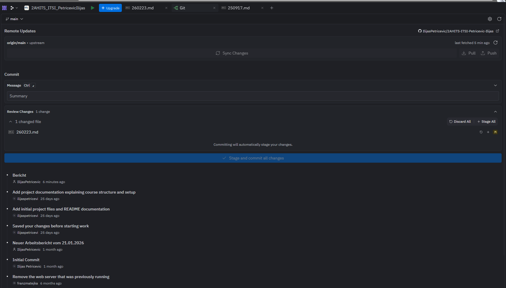

# Arbeitsbericht vom 17.09.2025

- Name: Ilijas Petricevic 
- Klasse: 2AHITS
- Gruppe: 2
- Fach: ITSI-Übungen
- Thema: Bericht abgeben über Github

# 1.Schritt

Wenn Sie eine Änderung gemacht haben an Ihrem Bericht oder was anderes, öffnen Sie die App Git, geben Sie bei Commit irgendwas ein wie Change oder Änderung und drücken Sie dann auf Stage and commit all changes. Danach drücken Sie weiter oben auf Sync Changes um es mit Ihrem verknüpften Github zu synchronisieren. Sie können auf Github den Prozess verfolgen indem Sie auf Actions nachschauen.

