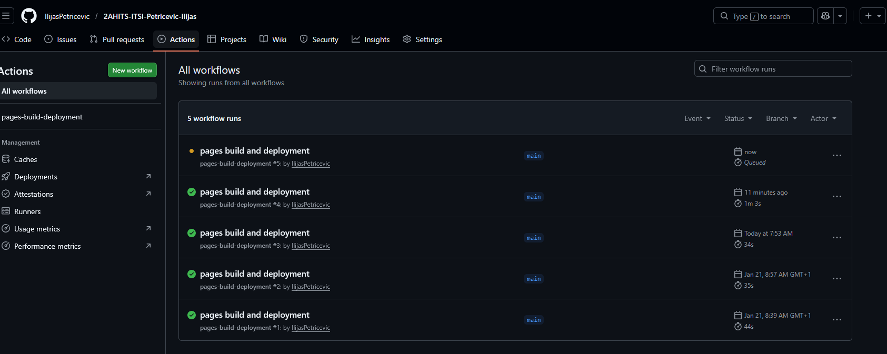
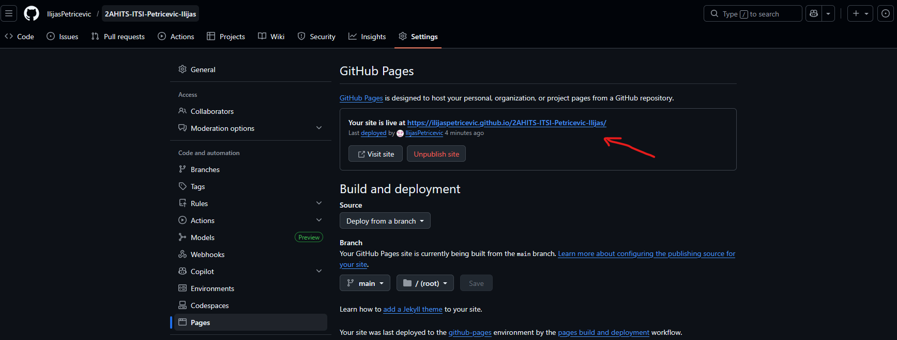
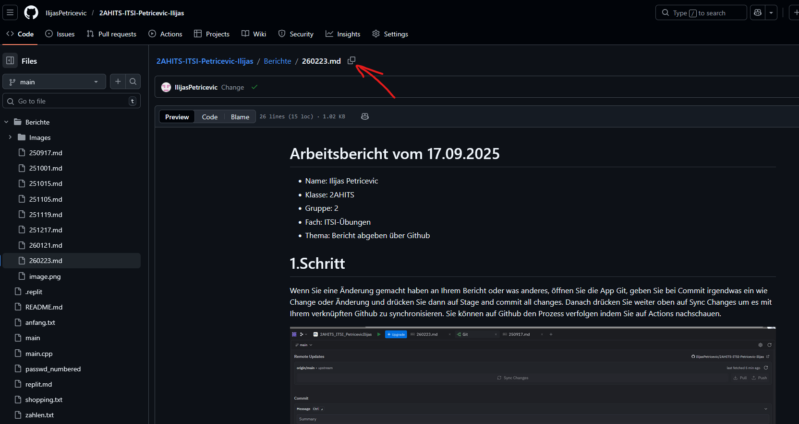
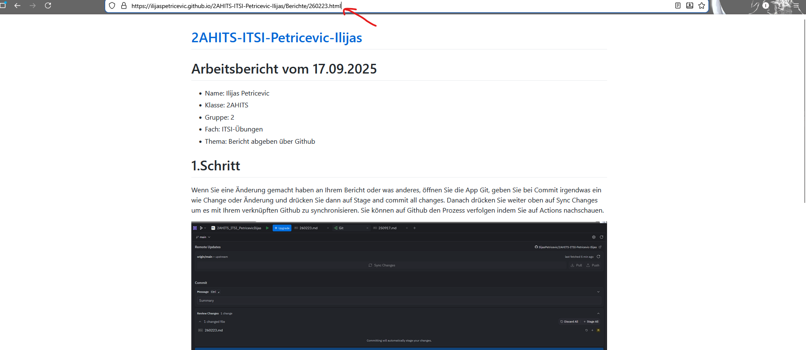

# Arbeitsbericht vom 23.02.2026

- Name: Ilijas Petricevic 
- Klasse: 2AHITS
- Gruppe: 2
- Fach: ITSI-Übungen
- Thema: Bericht abgeben über Github

# 1.Schritt

Wenn Sie eine Änderung gemacht haben an Ihrem Bericht oder was anderes, öffnen Sie die App Git, geben Sie bei Commit irgendwas ein wie Change oder Änderung und drücken Sie dann auf Stage and commit all changes. Danach drücken Sie weiter oben auf Sync Changes um es mit Ihrem verknüpften Github zu synchronisieren. Sie können auf Github den Prozess verfolgen indem Sie auf Actions nachschauen.

# 2.Schritt

Dann gehen Sie auf Github zu den Einstellungen und danach auf Pages, damit Sie den Link kopieren den Sie für später brauchen werden. Fügen Sie diesen Link in einem neuem Tab ein.

# 3.Schritt

Danach gehen Sie bei Github auf Code, wo Sie dann Ihre ganzen Dateien und Ordner auf Replit sehen sollten. Gehen Sie auf den Bericht den Sie abgeben wollen und kopieren Sie den Pfad. Fügen Sie diesen Pfad an den vorigen kopierten Link an. Dann müssen Sie am Ende des ganzen Links aus ein Markdown (.md), ein .html machen. Diesen Link kopieren Sie und geben Ihn über Teams ab.

